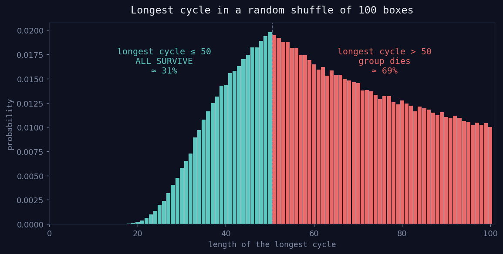

# 001 — The 100 Prisoners Problem

> The odds look like they should be `(1/2)^100` — a number so small it may as well be zero.
> The real answer is about **31%**. This is the story of how that gap exists.



*The whole puzzle in one picture: shuffle 100 boxes and look at the single longest cycle. If it's ≤ 50 (teal) everyone goes free; if it's > 50 (red) the group dies. The teal area is ~31% — the answer.*

---

## The Problem

100 prisoners are numbered 1 to 100. In a room sit 100 closed boxes, and inside each box is one of the numbers 1–100, placed in a **random order** (one number per box, no repeats).

One at a time, each prisoner walks into the room and may open **at most 50** boxes, hunting for their own number. Then they leave the boxes exactly as they found them and walk out. **No communication.** No rearranging boxes, no leaving marks, no signals to the next person.

If **every single prisoner** finds their own number, they all go free. If even **one** fails, everyone is executed.

They can agree on a strategy beforehand. **What strategy gives them the best shot, and what are the odds?**

---

## First, let's throw some things away

Before getting clever, eliminate the noise.

**"At most 50" really means "exactly 50."** There's no reward for opening fewer boxes — stopping early only lowers your chance of finding your number. So every prisoner opens boxes until they either find their number or hit the cap of 50. Treat the limit as a hard 50.

**Now the brute-force world: nobody coordinates.** Everyone just opens 50 boxes at random and hopes. One prisoner's odds here are clean: 50 boxes out of 100, so exactly a **50% chance** of finding their number. Fine for one person. But we don't need one person — we need **all 100** to succeed at once:

```
P(all 100 succeed) = (1/2) × (1/2) × ... × (1/2)   [100 times]
                   = (1/2)^100
                   ≈ 0.0000000000000000000000000000008
```

That's effectively zero. And here's the important realization it forces:

> **This was never about *me* winning. It's about *all of us* winning or *all of us* losing.**

100 independent coin flips will never all land heads. So a winning strategy can't leave the outcomes independent — it has to somehow **link everyone's fate together**, so that the failures pile up into the *same* scenarios instead of scattering across 100 separate coin flips. We need correlation. The question is where to find it.

---

## The only free information we have

Look at what the rules forbid: no talking, no reordering, no marks. It feels like there's nothing to work with.

But there's one thing they *never* forbid, and it's sitting right there:

> **The number you find inside a box can tell you which box to open next.**

You can't change anything about the room. But you're allowed to let the **contents of the boxes guide your path through them.** That's the crack in the door.

---

## Reframe: it's a treasure hunt

Stop thinking about "boxes and numbers." Think about it like this:

Every box, when you open it, hands you a **clue** — a number that says *"go open this box next."* You're following a trail of clues, hopping from box to box.

Here's the strategy, and it's almost stupidly simple. **Prisoner *k* does this:**

1. Start by opening **box number *k*** — the box matching your own number.
2. Read the number inside. Say it's *m*. → go open **box *m***.
3. Read *that* number, say *n*. → go open **box *n***. And so on.
4. Keep following the trail, up to 50 boxes.

That's the entire strategy. You're just following where each box points.

**Try it yourself** in the interactive app (`app/index.html`): pick a prisoner, and click along the trail. Watch what it does.

---

## Why the trail *must* loop back to you

Model it like a linked list. Box *k* points to box *m*, which points to box *n*, and so on — each box has a "next" pointer (the number inside it).

A trail like this can only do one of two things: **run forever**, or **loop back on itself.** It can't run forever — there are only 100 boxes, so eventually you must revisit one. So it **loops.** Good. But loops back to *where*?

Here's the subtle part. You might worry the trail loops but never comes back to your *starting* box — like a lollipop: `1 → 2 → 3 → 4 → 2` (loops on 2, strands the start). **That can't happen here**, and the reason is beautiful:

The boxes are a **perfect pairing**. Every number lives in exactly **one** box (so each box has exactly one arrow *out*), and every number appears exactly **once** across all boxes (so each box has exactly one arrow *in*). No box can be pointed at by two different boxes.

> If box 3 points to box 5, then **nothing else** can point to box 5 — box 4 can't also point there. So 5 can never be the middle of a lollipop.

One-arrow-in, one-arrow-out means **no tails are possible.** The trail can't stall in a lollipop — it has to come all the way home to box *k*.

And why does closing the loop mean *success*? Because the box that points back to *k* is, by definition, the box **containing the number *k*** — your number. The loop closing **is** the moment you find yourself.

> **Prisoner *k* succeeds if and only if the loop (cycle) containing *k* is 50 boxes long or shorter.**

---

## The whole thing is just cycles

A random arrangement of the boxes doesn't make one big loop — it shatters into several separate loops (mathematicians call them **cycles**). Some short, some long, no two sharing a box (we just proved a box can't be pointed at twice). Their lengths add up to 100:

```
|cycle₁| + |cycle₂| + ... = 100
```

Every prisoner lives on exactly one of these cycles, and they succeed exactly when their cycle is length ≤ 50. So the group walks free precisely when:

> **Every cycle has length ≤ 50.**

And the only way to *fail* is if some cycle is **longer than 50**. Now the magic: a permutation of 100 can contain **at most one** cycle longer than 50 — two cycles of length ≥ 51 would need ≥ 102 boxes, and we only have 100. So the entire group's fate collapses to a single yes/no question:

> **Is there one long cycle (length > 50) somewhere in this arrangement?**

- **No long cycle** → every prisoner's trail finishes in time → **all 100 go free.**
- **One long cycle** → everyone sitting on it runs out of opens → **the group dies.**

*This* is the correlation we were hunting for. The failures don't spread across 100 coin flips — they all collapse onto one event. Either the one bad cycle exists and drags its whole crew under, or it doesn't and everybody lives.

---

## A tiny world you can hold in your head (n = 4, open ≤ 2)

Take 4 boxes, each prisoner may open 2. Say the boxes contain:

```
box 1 → 3,   box 2 → 4,   box 3 → 1,   box 4 → 2
```

Follow the trails:
- Prisoner 1: opens box 1 → finds 3 → opens box 3 → finds **1**. ✅ (cycle `1→3→1`, length 2)
- Prisoner 3: opens box 3 → finds 1 → opens box 1 → finds **3**. ✅ (same cycle)
- Prisoner 2: opens box 2 → finds 4 → opens box 4 → finds **2**. ✅ (cycle `2→4→2`, length 2)
- Prisoner 4: same cycle as 2. ✅

Two cycles of length 2. All ≤ 2. **Everyone lives.**

Now a bad arrangement:

```
box 1 → 2,   box 2 → 3,   box 3 → 4,   box 4 → 1
```

That's one big cycle `1→2→3→4→1` of length 4. Prisoner 1 opens box 1 → 2 → opens box 2 → 3 → **out of opens**, never reached the box holding "1". Everyone on this length-4 cycle fails. **Group dies.**

Same rules, same prisoners — the *only* thing that changed the outcome was the longest cycle. That's the whole puzzle in miniature.

---

## The experiment

`simulation.py` runs 100,000 shuffles for both strategies and, crucially, records *where the failures live*. Running it:

```
n=100 prisoners, each may open k=50 boxes, 100,000 trials

Random strategy   :       0 / 100,000 survived (0.000000%)
  theory ~ (1/2)^100 ≈ 7.89e-31

Cycle strategy    :  31,093 / 100,000 survived (31.093000%)
  exact theory 1 - (1/51 + ... + 1/100) = 31.182782%

Longest-cycle length — where the failures live (cycle strategy):
  longest cycle <= 50  (ALL survive) :  31,093 (31.09%)
  longest cycle >  50  (group dies)  :  68,907 (68.91%)

  Every single failure is one event: a cycle too long to finish.
```

The random strategy never once wins. The cycle strategy wins ~31% of the time — and every failure is exactly the event "there was a cycle longer than 50." You can *watch* the theory be real.

---

## Now the math: why exactly ~31%

We need `P(no cycle longer than 50)`. Easier to compute the opposite and subtract.

**Key fact:** in a random arrangement of `N` items, the probability there's a cycle of *exactly* length `L` is **exactly `1/L`** (for any `L`). Here's the clean count:

- Total arrangements: `N!`.
- Count the ones with a specific length-`L` cycle:
  - Choose which `L` boxes are on the cycle: `C(N, L) = N! / (L!·(N−L)!)` ways.
  - Arrange those `L` boxes into one cycle: `(L−1)!` ways. *(L items can be ordered `L!` ways, but a cycle reads the same from any starting point, so divide by `L` → `(L−1)!`.)*
  - Arrange the other `N−L` boxes freely: `(N−L)!` ways.
  - Multiply: `[N!/(L!·(N−L)!)] × (L−1)! × (N−L)! = N! × (L−1)!/L! = N!/L`.
- Divide by the total: `(N!/L) / N! = 1/L`. ∎

So the probability that a "too-long" cycle exists — a cycle of length 51, 52, …, or 100 — and since at most one such cycle can exist these are mutually exclusive, we just add:

```
P(long cycle exists) = 1/51 + 1/52 + 1/53 + ... + 1/100 ≈ 0.6882
```

Therefore:

```
P(all survive) = 1 − 0.6882 ≈ 0.3118   →   about 31.18%
```

*(That sum is often written `H(100) − H(50)`, where `H(n) = 1 + 1/2 + ... + 1/n` is just shorthand for "add up the reciprocals.")*

**The punchline that never gets old:** as the number of prisoners grows, this doesn't fade to zero. It converges to `1 − ln(2) ≈ 0.3069`. Ten thousand prisoners? Still about 30%. A million? Still about 30%. The whole idea rests on one shift in how you look at the boxes — stop reading them as a flat list, and start seeing the cycles hiding inside them.

---

## Files

| File | What it is |
|------|-----------|
| `README.md` | This write-up. |
| `simulation.py` | Monte Carlo of both strategies + the longest-cycle breakdown. `python3 simulation.py` |
| `app/index.html` | Interactive pixelated demo — pick a prisoner, follow the trail, watch a cycle close. Open it in any browser. |
